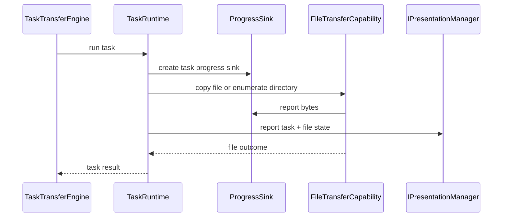

# Zeayii.Flow.Core

[简体中文](./README.md) | English

`Zeayii.Flow.Core` owns actual synchronization execution and is the runtime center of Zeayii.Flow.

## 1. Responsibilities

- maintain top-level task runtime
- handle file tasks and directory tasks
- apply conflict and failure policies
- execute async stream-based copy
- drive resume and finalization
- report task, file, progress and log state to presentation

## 2. Key directories

- `Abstractions/`: options, requests and policies
- `Engine/Contexts`: execution contexts and runtime state
- `Engine/Capabilities`: copy, retry and progress primitives
- `Engine/`: `TaskRuntime` and `TaskTransferEngine`

## 3. Call flow (Mermaid)

## 4. Key design choices

### 4.1 Async stream-based copy

The core path uses asynchronous `FileStream` read/write and does not outsource transfer semantics to `File.Copy`.

### 4.2 Artifact-driven recovery

- `.tmp` represents an intermediate artifact
- complete final output under `Resume` means skip
- incomplete temporary output means resume

### 4.3 Policy model

- `ConflictPolicy`
  - `Resume`
  - `Overwrite`
  - `Rename`
- `TaskFailurePolicy`
  - `Continue`
  - `StopCurrentTask`
  - `StopAll`

### 4.4 Cancellation model

`Core` now maintains three explicit cancellation scopes:

- `GlobalContext`
- `TaskExecutionContext`
- `FileExecutionContext`

Rules:

- child cancellation sources are always derived from parent scopes
- cancellation flows downward only
- a file failure does not directly cancel its parent task
- the task layer uses `TaskFailurePolicy` to decide whether that failure escalates into task cancellation or global cancellation

## 5. Outcome semantics

- `Completed`
- `Skipped`
- `Failed`
- `CompletedWithErrors`
- `Canceled`

Rules:

- single-file tasks: complete final output under `Resume` becomes `Skipped`
- directory tasks: if every file is skipped, the top-level task becomes `Skipped`
- canceled directory tasks converge unfinished discovered files to `Canceled`

## 6. Release checklist

- no duplicate progress accounting
- `Resume / Overwrite / Rename` semantics verified
- failure policy propagation verified
- file and directory result semantics verified

