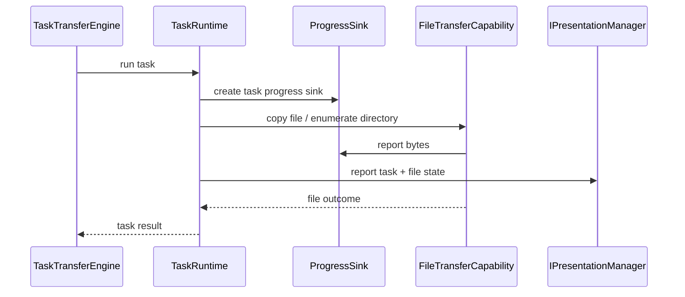

# Zeayii.Flow.Core

简体中文 | [English](./README.en.md)

`Zeayii.Flow.Core` 模块负责 Zeayii.Flow 的实际同步执行，是整个工程的运行时核心。

## 1. 模块职责

- 维护顶层任务运行时
- 管理目录任务和单文件任务
- 管理冲突策略与失败策略
- 执行异步流式复制
- 驱动断点续传与最终落盘
- 向呈现层汇报任务、文件、进度和日志

## 2. 核心目录

- `Abstractions/`：配置、请求、策略等抽象
- `Engine/Contexts`：运行上下文与状态
- `Engine/Capabilities`：复制、重试、进度等原子能力
- `Engine/`：`TaskRuntime` 与 `TaskTransferEngine`

## 3. 调用链（Mermaid）

## 4. 关键设计

### 4.1 异步流式复制

核心复制路径基于 `FileStream` 的异步读写，不把同步过程交给 `File.Copy`。

### 4.2 产物驱动恢复

- `.tmp` 表示中间产物
- 最终文件完整存在时，`Resume` 直接跳过
- 中间产物不完整时可续传

### 4.3 策略模型

- `ConflictPolicy`
  - `Resume`
  - `Overwrite`
  - `Rename`
- `TaskFailurePolicy`
  - `Continue`
  - `StopCurrentTask`
  - `StopAll`

### 4.4 取消模型

`Core` 现在显式维护三层取消上下文：

- `GlobalContext`
- `TaskExecutionContext`
- `FileExecutionContext`

约束：

- 下层取消令牌源总是由上层派生
- 取消只能向下传播
- 文件失败不会直接反向取消任务
- 任务层根据 `TaskFailurePolicy` 决定是否升级为任务取消或全局取消

## 5. 结果语义

- `Completed`
- `Skipped`
- `Failed`
- `CompletedWithErrors`
- `Canceled`

规则：

- 单文件：目标已完整存在时，在 `Resume` 下表现为 `Skipped`
- 目录：全部文件都跳过时，顶层任务表现为 `Skipped`
- 目录取消：已发现但未终结的文件会收敛为 `Canceled`

## 6. 发布检查清单

- 进度累计无重复记账
- `Resume / Overwrite / Rename` 语义正确
- 失败策略传播正确
- 单文件与目录任务结果语义正确

