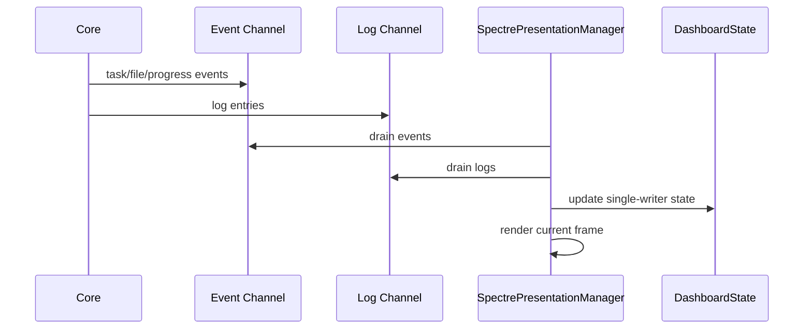

# Zeayii.Flow.Presentation

[简体中文](./README.md) | English

`Presentation` owns terminal dashboard layout, state rendering, log display and input handling.

## 1. Responsibilities

- render the three-column main dashboard
- render the detail page
- aggregate log and event snapshots
- handle scrolling, selection and page switching
- keep terminal rendering stable and low-jitter

## 2. Core components

- `SpectrePresentationManager`
- `DashboardState`
- `RenderText`
- `LogBuffer`
- `PresentationEvents`
- `ViewModels`

## 3. UI structure

- header: parameters on the left, summary on the right
- left: detailed task list
- middle: status distribution grid
- right: logs
- detail page: per-task file list, including Failed / Skipped / Canceled terminal states

## 4. Rendering flow (Mermaid)

## 5. Design constraints

- UI state must stay single-writer
- left and middle columns are fixed-width
- right column is adaptive
- counts, rates and elapsed time should minimize visual jitter
- final-frame behavior should stay stable without unnecessary flicker

## 6. Release checklist

- three-column layout is correct
- left/middle/right scrolling works
- detail page scroll works
- CJK path alignment is correct
- final frame behavior is acceptable

