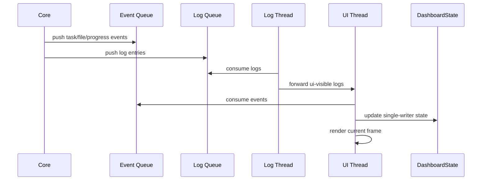

# Zeayii.Flow.Presentation

简体中文 | [English](./README.en.md)

`Presentation` 模块负责终端 Dashboard 的布局、状态呈现、日志展示和交互处理。

## 1. 模块职责

- 渲染三列主界面
- 渲染详情页
- 聚合日志快照与事件快照
- 管理输入滚动、选择和页面切换
- 提供稳定宽度、低抖动的终端渲染体验

## 2. 核心组件

- `SpectrePresentationManager`
- `DashboardState`
- `RenderText`
- `LogBuffer`
- `PresentationEvents`
- `ViewModels`

## 3. 界面结构

- 标题栏：左参数、右摘要
- 左列：任务详细列表
- 中列：状态分布网格
- 右列：日志输出
- 详情页：单任务文件列表（含 Failed / Skipped / Canceled 终态）

## 4. 渲染链路（Mermaid）

## 5. 设计约束

- UI 状态必须保持单写者模型
- UI 与日志使用独立线程，职责分离
- 业务线程向 UI/日志队列无阻塞投递，避免反压业务执行
- 左列和中列固定宽
- 右列自适应
- 数字、速率、耗时要尽量避免抖动
- 终态收尾要尽量稳定，不引入额外闪屏

## 6. 发布检查清单

- 三列布局正确
- 左中右滚动语义正确
- 详情页可滚动
- 中文路径显示对齐
- 终态收尾符合预期

